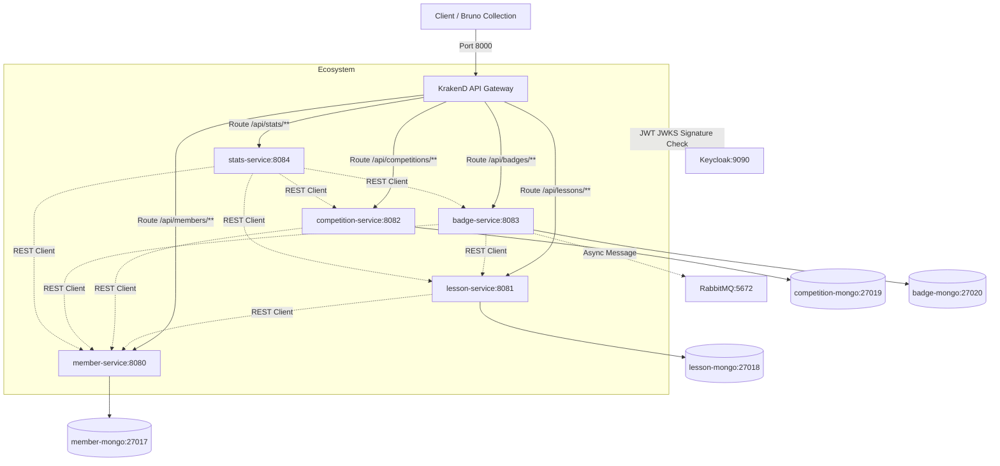
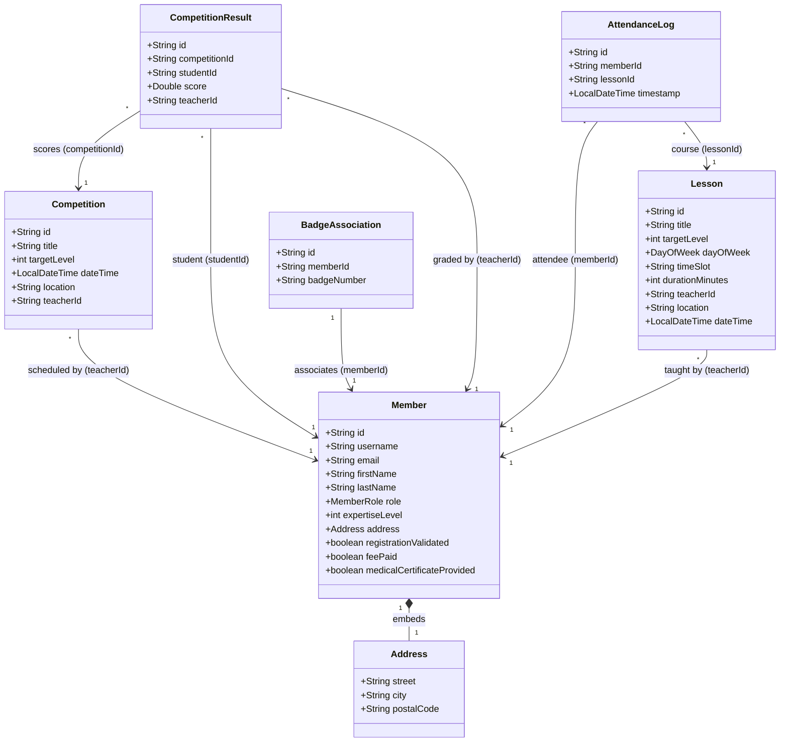

# Odoru - Rhythmic Dance Club Platform

Odoru is a distributed platform designed to manage member registrations, course planning, competition scheduling, attendance swiping, and statistics reporting for a rhythmic dance club.

## Modifications apportées depuis ce midi

- **MongoDB par service :** Séparation de la base de données en 4 instances indépendantes (Database-per-Service).
- **Optimisation des microservices :** Passage sous Alpine Linux (images plus légères), limitation de la RAM et démarrages beaucoup plus rapides.
- **Correction de `/api/badges/scan` :** Fix du JWT, de l'envoi des paramètres et des rôles d'accès.
- **Test Bruno 100% auto :** Mise à jour des variables dynamiques et automatisation complète (les 36 tests RBAC passent au vert).
- **Ajout d'outillage Mise :** Nouvelles commandes (`start`, `destroy`, `reset`, `test-e2e`) pour piloter tout le cycle de vie facilement.

---

## 1. System Architecture

The application is structured as a collection of microservices behind a high-performance **KrakenD API Gateway**, authenticated using **Keycloak** (OAuth2/OIDC), and using **MongoDB** for persistence and **RabbitMQ** for messaging.



---

## 2. Microservices Data Schemas

Each microservice manages its own domain boundary in its dedicated MongoDB instance. The class diagram below illustrates the entity properties and logical relationships:



---

## 3. How to Run the Platform

### Using Mise (Recommended)
This project uses [Mise](https://mise.jdx.dev/) for task orchestration and tool management.

**Installation:**
- Windows: `winget install jdx.mise`
- macOS/Linux: `curl https://mise.run | sh`

| Command | Description |
|---|---|
| `mise run up` | **Build** and start the entire Docker Compose stack. |
| `mise run start` | Start the stack **without** rebuilding images (`docker compose up -d`). |
| `mise run down` | Stop the Docker Compose stack. |
| `mise run destroy` | ⚠️ Stop and **completely wipe** containers, databases (volumes), and local images. |
| `mise run reset` | ⚠️ Destroy everything and recreate the environment from scratch (clean slate). |
| `mise run test-e2e` | Run the automated Bruno E2E API tests against the running stack. |
| `mise run test` | Run Java unit tests across all microservices using Maven. |
| `mise run lint` | Run Checkstyle verification across all microservices. |

*If you do not have `mise` installed, you can look at the `mise.toml` file for the exact raw commands.*

### Access Points
- **API Gateway (Single Entry Point):** `http://localhost:8000`
- **Keycloak Admin Panel:** `http://localhost:9090` (Admin Credentials: `admin` / `admin`)
- **RabbitMQ Management UI:** `http://localhost:15672` (Credentials: `guest` / `guest`)
- **Microservices Endpoints (Internal / Gateway Routed):**
  - Member Service: `http://localhost:8000/api/members`
  - Lesson Service: `http://localhost:8000/api/lessons`
  - Competition Service: `http://localhost:8000/api/competitions`
  - Badge Service: `http://localhost:8000/api/badges`
  - Stats Service: `http://localhost:8000/api/stats`

---

## 4. API Testing with Bruno

A complete, **fully automated** End-to-End testing scenario collection is available in the `bruno/` folder. It tests 100% of the routes, verifying success states and Role-Based Access Control (RBAC) rejection layers.

### Automated Testing
To run the full suite automatically on a fresh database:
```bash
mise run test-e2e
```

### Manual Testing
1. Install the [Bruno API Client](https://www.usebruno.com/).
2. Open Bruno, click **Open Collection**, and select the `bruno/` directory.
3. Select the **Local** environment.
4. Run the requests. The collection automatically handles dynamic variable injection (tokens, generated IDs) between requests.
