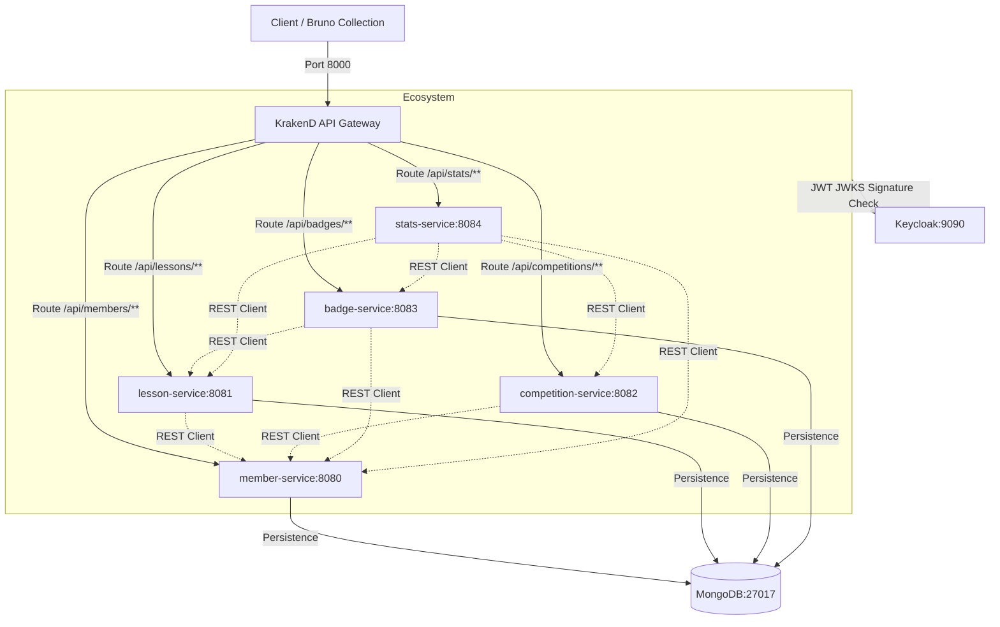
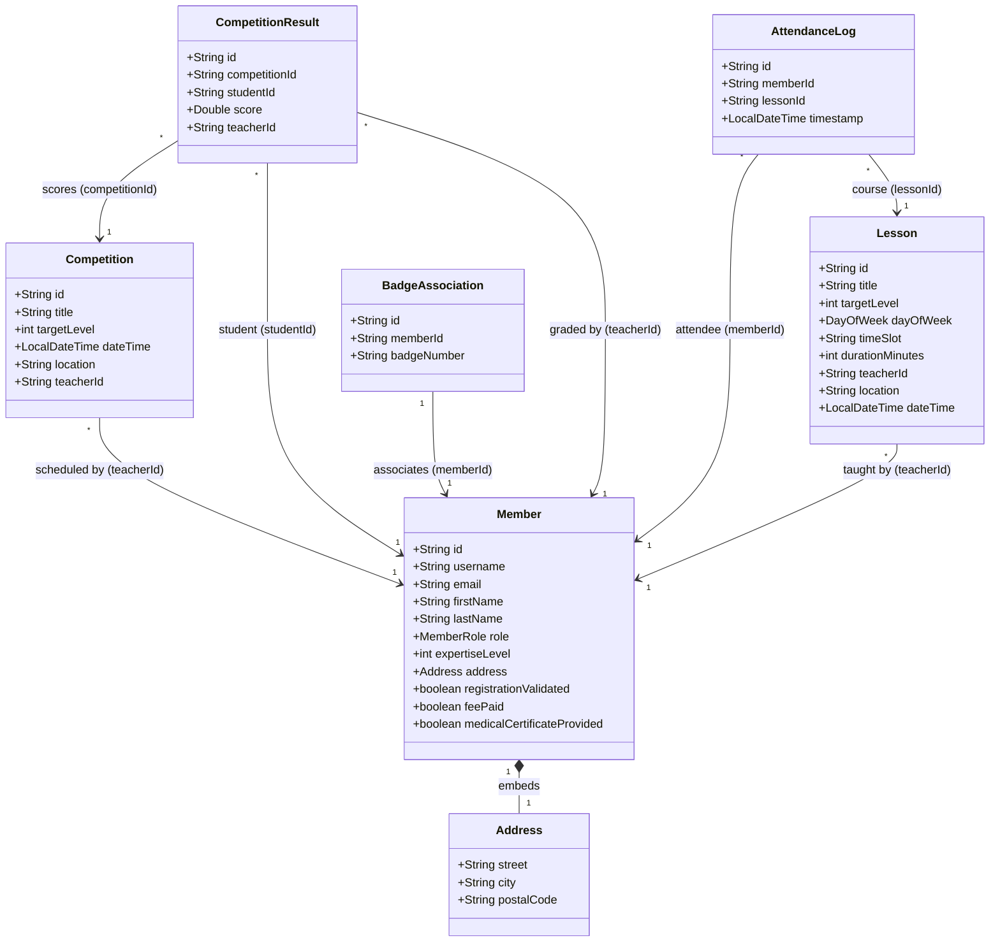

# Odoru - Rhythmic Dance Club Platform

Odoru is a distributed platform designed to manage member registrations, course planning, competition scheduling, attendance swiping, and statistics reporting for a rhythmic dance club.

---

## 1. System Architecture

The application is structured as a collection of microservices behind a high-performance **KrakenD API Gateway**, authenticated using **Keycloak** (OAuth2/OIDC), and using **MongoDB** for persistence.



---

## 2. Microservices Data Schemas

Each microservice manages its own domain boundary in MongoDB. The class diagram below illustrates the entity properties and logical relationships across the databases:



---

## 3. How to Run the Platform

### Prerequisites
- Docker & Docker Compose installed.

### Start the entire platform
Build and start Keycloak, MongoDB, the API Gateway, and the five Spring Boot microservices:
```bash
docker-compose up --build -d
```

### Access Points
- **API Gateway (Single Entry Point):** `http://localhost:8000`
- **Keycloak Admin Panel:** `http://localhost:9090` (Admin Credentials: `admin` / `admin`)
- **Microservices Endpoints (Internal / Gateway Routed):**
  - Member Service: `http://localhost:8000/api/members`
  - Lesson Service: `http://localhost:8000/api/lessons`
  - Competition Service: `http://localhost:8000/api/competitions`
  - Badge Service: `http://localhost:8000/api/badges`
  - Stats Service: `http://localhost:8000/api/stats`

---

## 4. API Testing with Bruno

A complete testing scenario collection is available in the [bruno/](file:///c:/Users/guill/Documents/Project/Odoru/bruno) folder.

1. Install the [Bruno API Client](https://www.usebruno.com/).
2. Open Bruno, click **Open Collection**, and select the [bruno/](file:///c:/Users/guill/Documents/Project/Odoru/bruno) directory.
3. Select the **Local** environment.
4. Run the requests sequentially from `01_Authentication` onwards. Access tokens will automatically extract and populate the environment variables.
